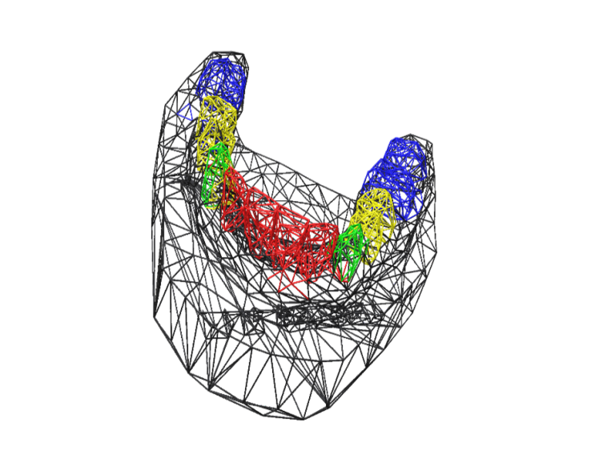

# DentalMeshCNN
The central idea of our work is to perform segmentation on a dental
arches database collected from different dental prosthetists specifically
for this task.
We decided to work with MeshCNN,by Rana Hanocka
a neural network specially designed for 3D triangular meshes which
revealed impressive results on mesh segmentations. We then focused
on preparing our database and adapt it to the task.
the code prensents an update of 3D mesh visualisation in MeshCNN by using Polyscope.

 
you can also get pre-trained weights using bash in dental_seg folder
Check out the [MeshCNN wiki](https://github.com/ranahanocka/MeshCNN/wiki) for more details abou the network . Specifically, see info on [segmentation](https://github.com/ranahanocka/MeshCNN/wiki/Segmentation) and [data processing](https://github.com/ranahanocka/MeshCNN/wiki/Data-Processing).

